# Godthrone | Gehenna
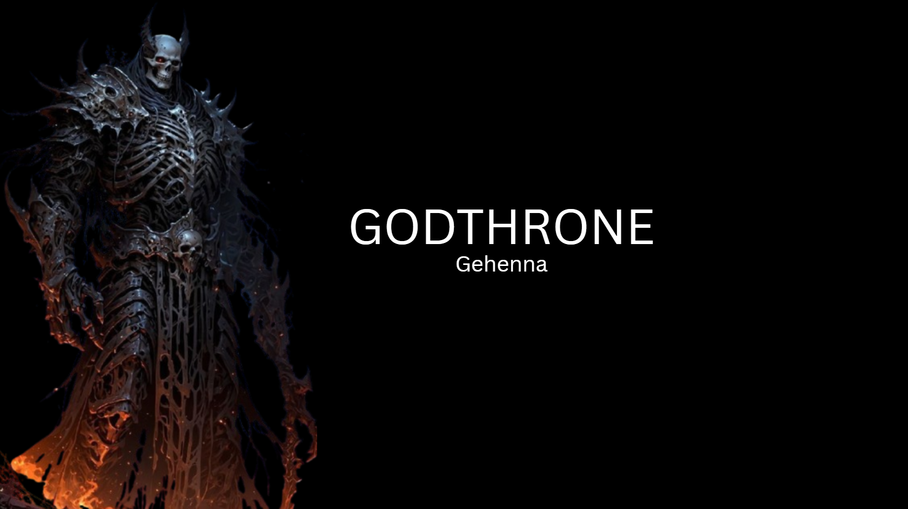

Welcome to **Godthrone | Gehenna**, an immersive, web based turn based tactical battle arena set within the dark cosmic mythos of the *Godthrone* universe. Choose your divine or horrific entity, experience atmospheric visual novel storytelling, and conquer the linear gauntlet in the arena of the gods.

<hr>

## 📸 Screenshots & Design Blueprints

Here is a preview of the interface, tactical battle arena, and system design documentation in action:

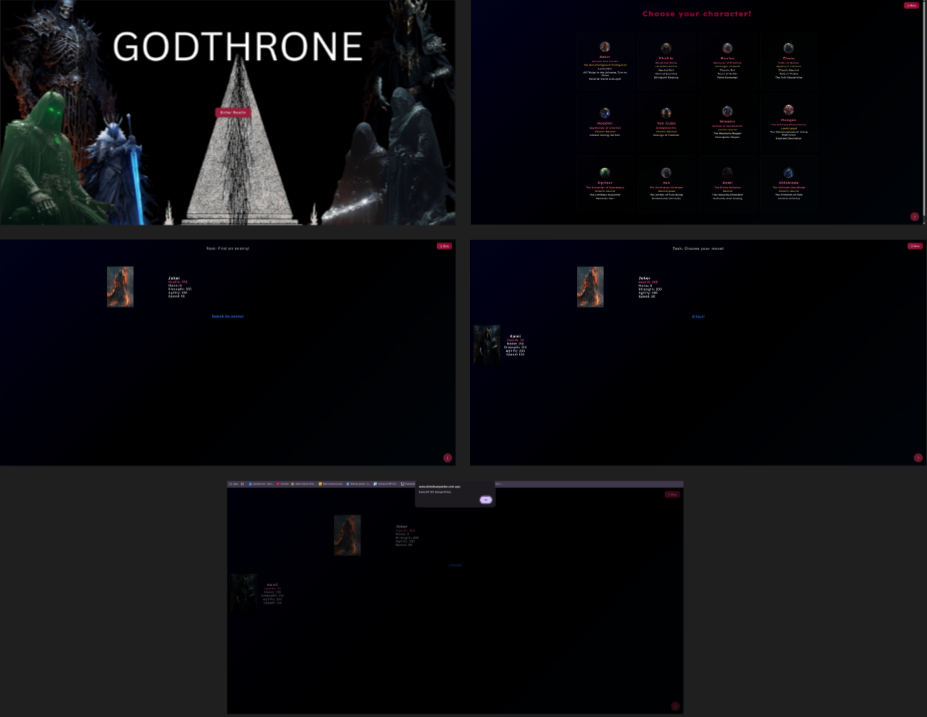
*Figure 1: Old Game Design Document and legacy system architecture documentation.*

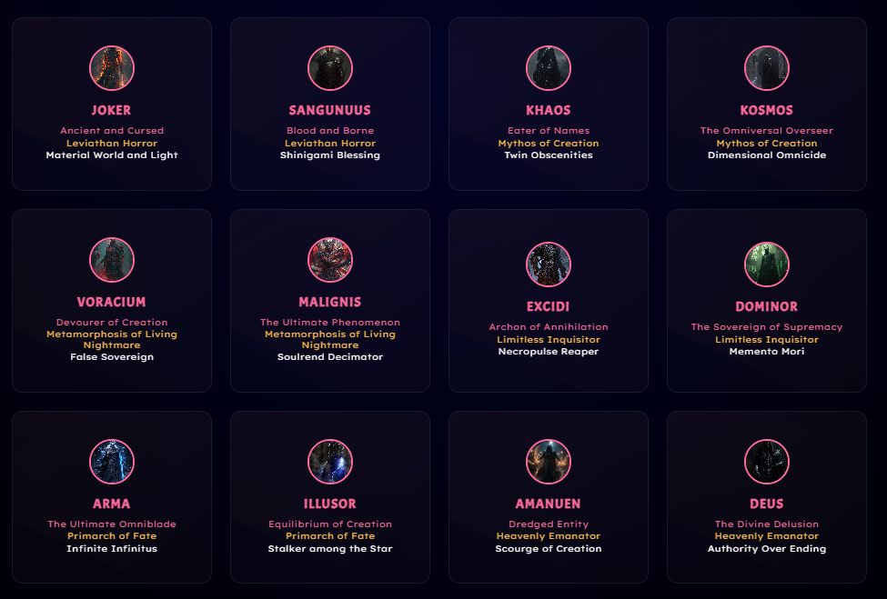
*Figure 2:  Old Game Design Document of character Selection Grid featuring deep space visuals and shrunken tactile cards.*

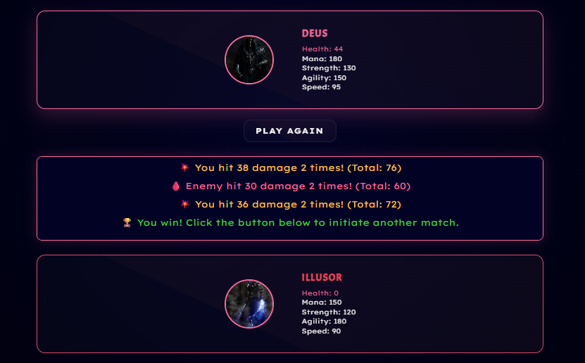
*Figure 3:  Old Game Design Document of Active turn based combat showing state changes, modular player statistics, and enemy health monitoring.*

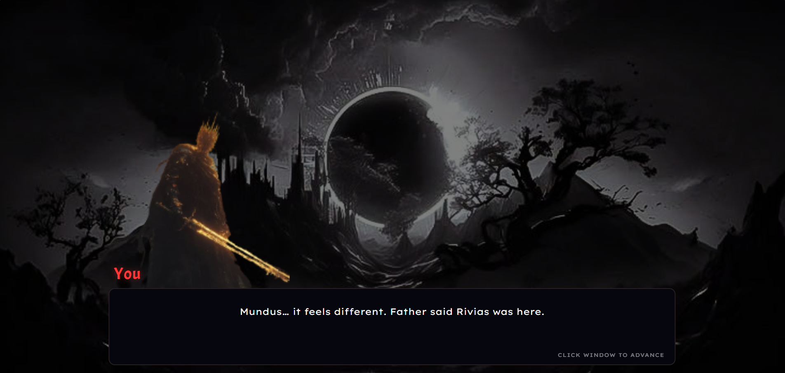
*Figure 4: New Game Design Document of Novel.*

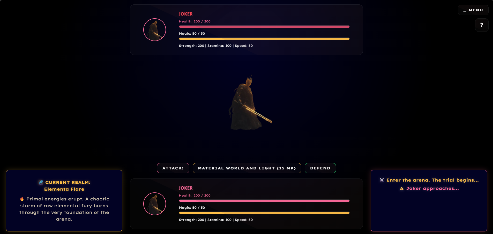
*Figure 4: New Game Design Document of Combat.*


<hr>

## ✨ Key Features

* **12 Playable Cosmic Entities:** Choose from highly specialized classes from the ancient and cursed *Joker* to the absolute authority of *Deus*, each packed with custom mechanical profiles, weapons, and deep lore tags.
* **Visual Novel Combat Integration:** A seamless narrative engine where character selection immediately launches immersive visual novel dialogue scenes that transition directly into linear turn based battles.
* **Dynamic Combat Engine:** A robust speed based initiative system that determines turn sequence, featuring randomized critical multipliers, hit rates scaled by Agility, and damage formulas shifting dynamically based on resource pools.
* **The Three Matchup Pillars:** Strategic combat balance built around a tactical triangle of Juggernauts, Burst Nukers, and Stat Stealers.
* **Premium Visual Identity:** Built with a custom cosmic aesthetic using a deep space radial gradient layout (`#020224` to `#000000`), featuring the sharp typography of **Acme** for titles and **Lexend Exa** for pristine body text tracking, accented by Pink (`#ff6b9d`) and Gold (`#ffc048`).
* **The "Secret Sauce" Interface:** Interactive card designs and menu toggles configured with radial glows (`::before`), sweeping red motion effects (`::after`), and smooth scale and lift transitions on hover.
* **Fully Responsive Architecture:** Optimized interface grid using CSS Grid auto fit properties with a `720px` max width that fluidly centers 3 card rows without layout cracking.

<hr>

## 📐 Core Game & VN Combat Integration Blueprint

This section serves as the official architectural specification and understanding document for integrating the Visual Novel system into the existing combat engine without altering aesthetics, layouts, or core combat calculations.

### 1. Core Goal
Integrate the Visual Novel system into the combat browser game so that narrative storytelling becomes the primary driver of the gameplay loop, completely replacing randomized enemy searching while preserving all original UI designs and mechanics.

### 2. High Level Flow & Linear Progression
* **Step 1: Character Selection:** The player clicks one of the 12 characters. No combat begins, and no search enemy buttons are displayed. Instead, **VN Scene 1** starts immediately.
* **Step 2: VN Scene 1 Concludes:** After the final dialogue line of the scene, the game transitions directly into combat against the first eligible opponent from the remaining 11 characters.
* **Step 3: Combat Victory:** After defeating the adversary, combat concludes and **VN Scene 2** begins for that same storyline.
* **Step 4: VN Scene 2 Concludes:** Combat immediately initiates against the next adversary in the fixed linear sequence.
* **Step 5: The Gauntlet Loop:** Each character follows an identical sequential pattern (`VN Scene 1 → Fight → VN Scene 2 → Fight → VN Scene 3 → Fight → etc.`) until all 11 opponents are defeated.
* **Step 6: Game Conclusion:** Upon defeating the final character in the sequence, the Visual Novel engine presents the climactic final ending scene.

### 3. Fixed Gauntlet Order
All encounters strictly follow this immutable sequence (skipping the player selected protagonist):

```text
Joker → Sangunuus → Khaos → Kosmos → Voracium → Malignis → Excidi → Dominor → Arma → Illusor → Amanuen → Deus
```

<hr>

# ⚔️ Master Roster: All 12 Character Profiles

## 1. 🥊 Joker  
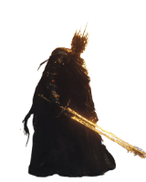

**Class:** Fighter  
**Weapon:** Material World and Light  
**Core Stats:** Strength, Speed, Stamina  

**Attack:** Do damage to the target. Builds Combo Stacks.  
**Special Attack (10 Magic):** Heavy damage; consumes Combo Stacks.  
**Defend:** Lost HP converts into Magic.  

**Unique Playstyle:** The Tempo Combo Fighter.

---

## 2. 🩸 Sangunuus  
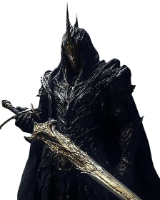

**Class:** Bloodletter  
**Weapon:** Shinigami Blessing  
**Core Stats:** Strength, Stamina, Magic  

**Attack:** Consumes Bleed Stacks for bonus damage.  
**Special Attack (10 Magic):** Inflicts Bleed Stacks.  
**Defend:** Sacrifice HP to empower next move.  

**Unique Playstyle:** High-Risk Damage Over Time (DoT) Archetype.

---

## 3. 🥷 Khaos  
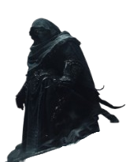

**Class:** Assassin  
**Weapon:** Twin Obscenities  
**Core Stats:** Speed, Stamina, Magic  

**Attack:** Permanently increases own stats (max 5).  
**Special Attack (10 Magic):** Heavy damage + steals HP/Magic.  
**Defend:** Next attack siphons enemy stats (max 3).  

**Unique Playstyle:** The Stat-Stealer Snowballer.

---

## 4. 🌌 Kosmos  
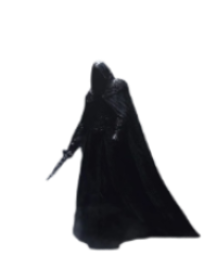

**Class:** Rogue  
**Weapon:** Dimensional Omnicide  
**Core Stats:** Speed, Stamina, Magic  

**Attack:** Steals Magic.  
**Special Attack (10 Magic):** Heavy damage scaling with Omnicide Stacks.  
**Defend:** Deflect hits to gain Omnicide Stacks.  

**Unique Playstyle:** The Counter-Striking Tactician.

---

## 5. 👹 Voracium  
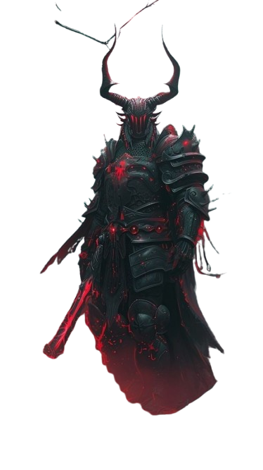

**Class:** Berserker  
**Weapon:** False Sovereign  
**Core Stats:** Strength, Speed, Stamina  

**Attack:** Standard physical damage.  
**Special Attack:** Consumes ALL Magic for massive damage.  
**Defend:** Takes full damage to gain Magic.  

**Unique Playstyle:** The All-In Glass Cannon Berserker.

---

## 6. 🛡️ Malignis  


**Class:** Gladiator  
**Weapon:** Soulrend Decimator  
**Core Stats:** Strength, Speed, Magic  

**Attack:** Using twice grants 2 stacks for Special.  
**Special Attack (10 Magic):** Heavy damage + empowers next Attack.  
**Defend:** Restores HP + Gladiator Stack (0 Magic).  

**Unique Playstyle:** The Infinite Loop Brawler.

---

## 7. ☠️ Excidi  
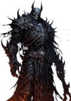

**Class:** Decimator  
**Weapon:** Necropulse Reaper  
**Core Stats:** Strength, Speed, Stamina  

**Attack:** Grants empowerment stack.  
**Special Attack (10 Magic):** Bonus damage if used after Attack/Defend.  
**Defend:** Grants empowerment + permanently increases max HP.  

**Unique Playstyle:** The Permanent Scaling Juggernaut.

---

## 8. ⚖️ Dominor  
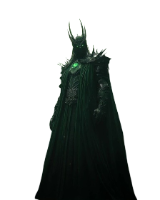

**Class:** Inquisitor  
**Weapon:** Memento Mori  
**Core Stats:** Strength, Speed, Magic  

**Attack:** Generates Magic.  
**Special Attack:** Consumes ALL Magic.  
**Defend:** Bigger buff the lower your Magic is.  

**Unique Playstyle:** The Inverse Resource Controller.

---

## 9. 🔮 Arma  
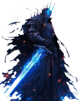

**Class:** Spellblade  
**Weapon:** Infinite Infinitus  
**Core Stats:** Strength, Stamina, Magic  

**Attack:** Standard damage.  
**Special Attack (10 Magic):** Amplified if used after Defend.  
**Defend:** Permanently increases HP (max 3).  

**Unique Playstyle:** The Tactical Shield-Burster.

---

## 10. 🌠 Illusor  


**Class:** Sorcerer  
**Weapon:** Stalker Among Star  
**Core Stats:** Strength, Speed, Stamina, Magic  

**Attack:** Permanently increases Speed.  
**Special Attack (15 Magic):** Builds tracking stacks.  
**Defend:** Restores Magic; shatters illusion for double damage.  

**Unique Playstyle:** The Mind-Game Spellspammer.

---

## 11. 🪄 Amanuen  
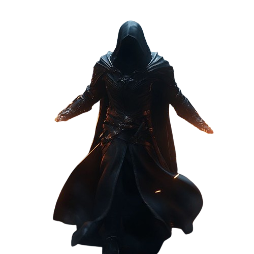

**Class:** Conjurer  
**Weapon:** Scourge of Creation  
**Core Stats:** Speed, Stamina, Magic  

**Attack:** Amplified after Defend.  
**Special Attack (10 Magic):** Amplified after Defend.  
**Defend:** Grants empowerment stacks for both Attack + Special.  

**Unique Playstyle:** The Defend-Centric Counter-Mage.

---

## 12. 👁️ Deus  
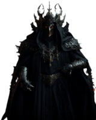

**Class:** Warlock  
**Weapon:** Authority Over Ending  
**Core Stats:** Speed, Stamina, Magic  

**Attack:** Standard damage.  
**Special Attack (10 Magic):** Amplified after Defend.  
**Defend:** Converts incoming damage into Special buff + partial heal.  

**Unique Playstyle:** The Kinetic Siphon Warlock.
